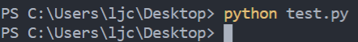
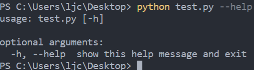
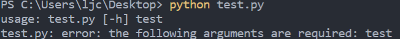
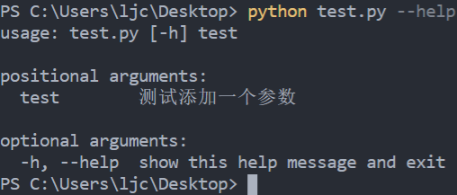

argparse是python的一个用于解析命令行的标准库
<!-- more -->
## 一个什么也没实现的例子
```python
import argparse

parser = argparse.ArgumentParser()
parser.parse_args()
```

上面这段代码如果直接执行什么也不做


加上`--help`会输出默认的帮助信息


## 添加位置参数
```python
import argparse

parser = argparse.ArgumentParser()
parser.add_argument("test")
args = parser.parse_args()
print(args.test)
```

上面的代码添加了一个命令行参数`test`，直接执行会报错


带上参数执行会执行输出语句


## 为参数提供帮助信息
```python
import argparse

parser = argparse.ArgumentParser()
parser.add_argument("test", help="测试添加一个参数")
args = parser.parse_args()
print(args.test)
```

在添加参数时，指定`help`的内容可以给参数添加帮助信息，可通过`--help`查看


## 指定参数类型
```python
import argparse

parser = argparse.ArgumentParser()
parser.add_argument("number", help="测试添加一个参数", type=int)
args = parser.parse_args()
print(args.number + 1)
```

如果不给定`type`指定参数类型，默认是`str`类型

## 添加可选参数
待续...