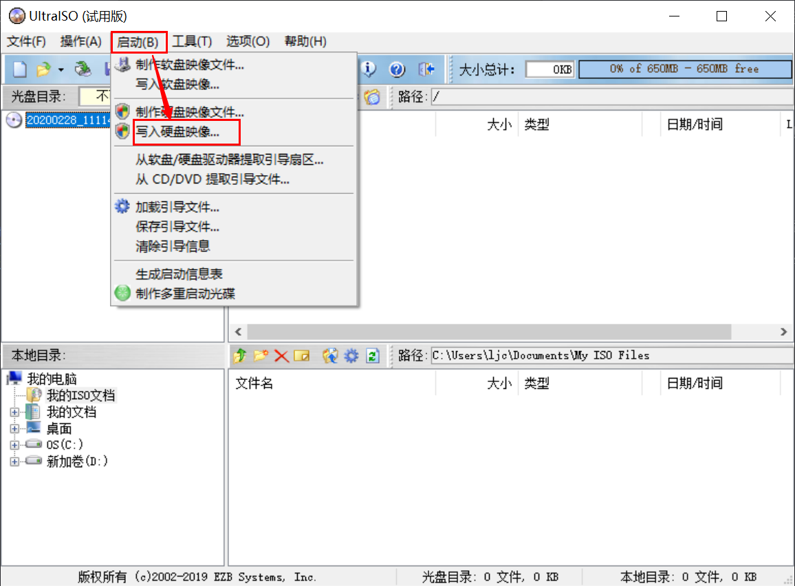
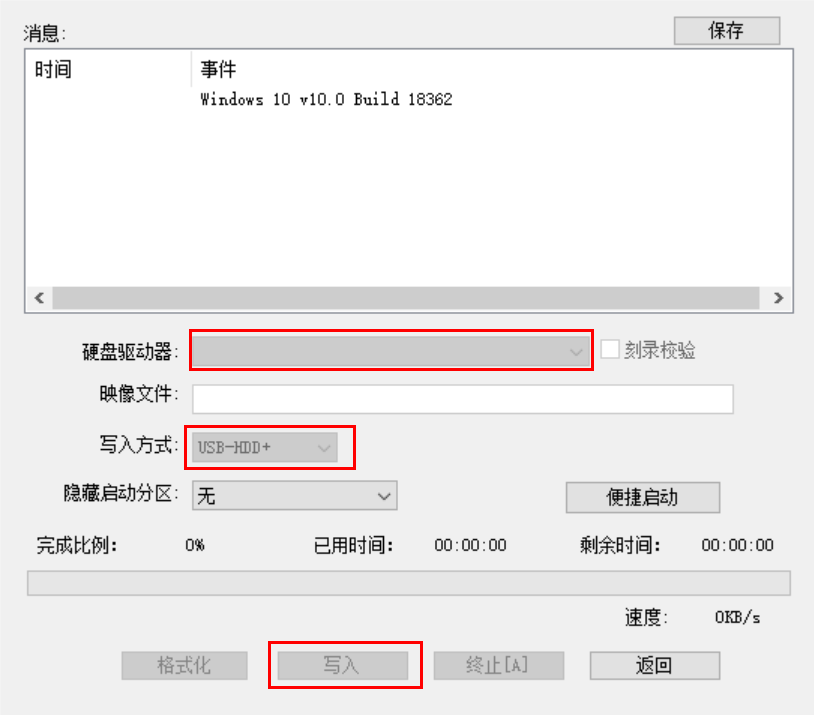
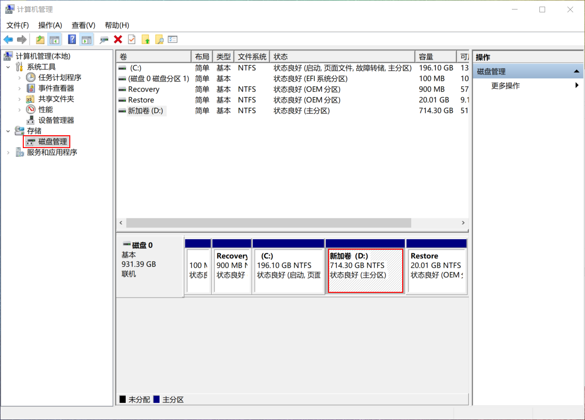
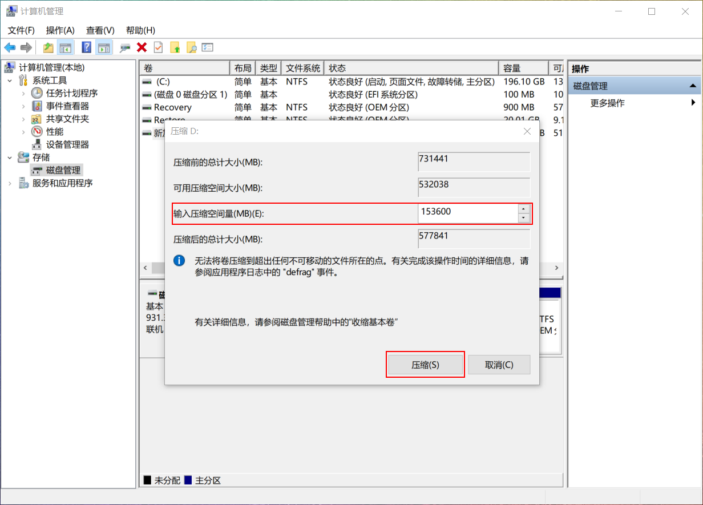
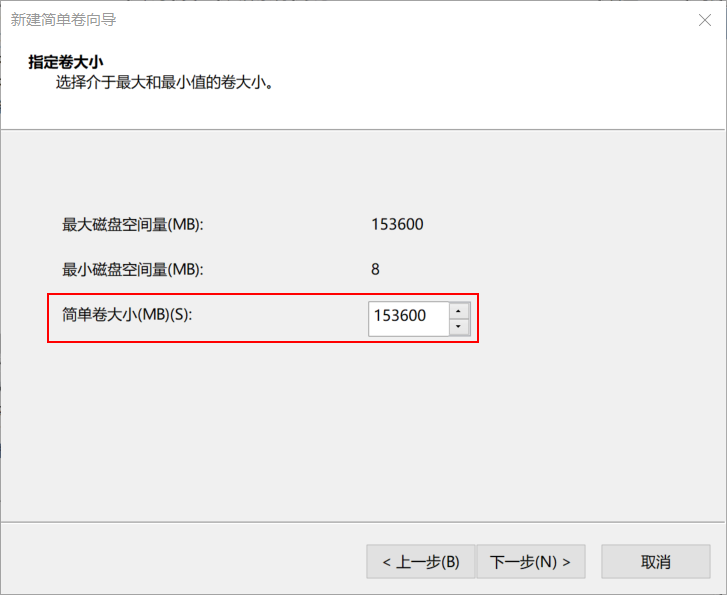
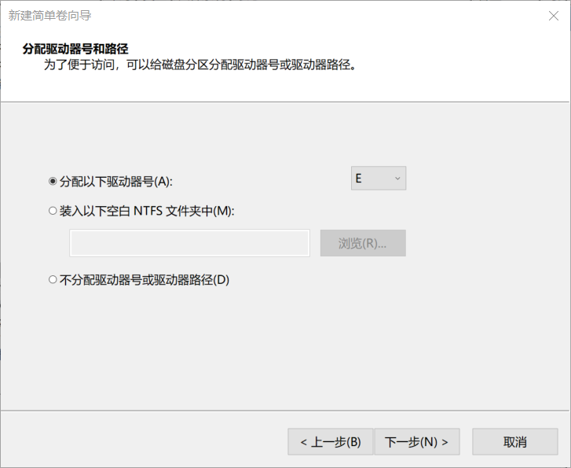
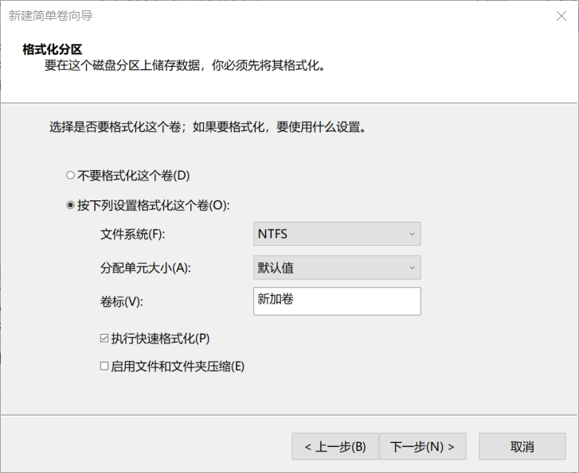

记录一下在已有win10系统的电脑上安装manjaro构成双系统
<!-- more -->
## 下载manjaro
在[manjaro官网](https://manjaro.org/download/)下载manjaro，或使用[国内镜像](https://mirrors.tuna.tsinghua.edu.cn/osdn/storage/g/m/ma/)下载

## 创建u盘启动盘
需要一个空u盘，和[UItraISO工具](https://cn.ultraiso.net/xiazai.html)制作u盘启动盘

1. 文件->打开，选择下载好的iso文件
2. 启动->写入硬盘映像
   
3. 选择准备好的空u盘，将写入方式设置为RAW（USB-HDD+方式对manjaro来说在安装时无法识别），点击写入，等待写入完成
   

这样，u盘启动盘就制作好了

## 分区
为了构成双系统，需要先将win10系统上分出一个空白分区

1. 右键"此电脑"，单击"管理"，选择"磁盘管理"
   
2. 右键选择需要压缩的磁盘，点击"压缩卷"，输入压缩空间量，点击"压缩"
   
3. 等待压缩完成后会出现一块未分配的磁盘空间，右键该区域，点击"新建简单卷"，其中需要输入"简单卷大小"，然后一路下一步，直到完成
   
   
   

## 安装
### 进入BIOS，修改启动项为u盘启动
重启系统，进入BIOS，各个品牌的电脑进入BIOS的方式不同，请自行查询

进入BIOS后，将secure boot关闭，在boot选项页中将u盘启动移至第一位，然后等待重启

### manjaro的安装
根据提示安装即可，记得driver选择nonfree

## 安装后的配置
### 更新镜像源
`sudo pacman-mirrors -i -m rank -c China`

同步`sudo pacman -Syy`

更新系统`sudo pacman -Syyu`

使用root权限编辑`/etc/pacman.conf`增加以下内容
```
[archlinuxcn]
SigLevel = Optional TrustedOnly
Server =https://mirrors.ustc.edu.cn/archlinuxcn/$arch
```

然后执行`sudo pacman -Syy && sudo pacman -S archlinuxcn-keyring`

### 中文输入法
`sudo pacman -S fcitx-im (#默认全部安装)`

`sudo pacman -S fcitx-configtool`

`sudo pacman -S fcitx-sogoupinyin (#安装搜狗拼音)`

添加配置文件`~/.xprofile`，输入以下内容
```
export GTK_IM_MODULE=fcitx
export QT_IM_MODULE=fcitx
export XMODIFIERS="@im=fcitx"
```

重启

### zsh
`sudo pacman -S zsh`

`sh -c "$(curl -fsSL https://raw.github.com/robbyrussell/oh-my-zsh/master/tools/install.sh)" # 下载并配置ohmyzsh`

`chsh -s /bin/zsh  #更换默认bash，重启后生效`

#### 修改zsh主题

主题文件都存放在`~/.oh-my-zsh/themes`下，修改`~/.zshrc`配置文件中的：`ZSH_THEME="你想要的主题"`

让配置文件生效：`source ~/.zshrc`


### vim
`sudo pacman -S vim`

### AUR助手（以防官方仓库没有想要的软件）
`sudo pacman -S yay`