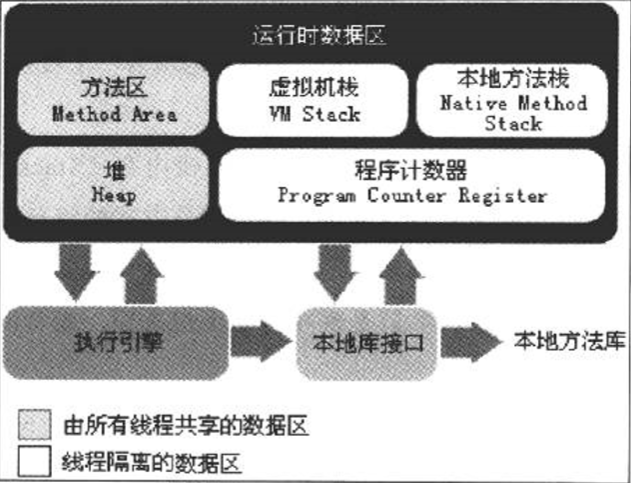

Java内存区域与内存溢出异常

<!-- more -->

## 运行时数据区域

Java虚拟机将内容分为下图的几个部分：

### 程序计数器

每个线程都要自己独立的程序计数器

当执行Java方法时，程序计数器中记录着虚拟机字节码指令的地址

当执行Native方法时，程序计算器中内容为空（注：Native方法可以理解为不是由Java实现的方法）

程序计数器是Java虚拟机规范中唯一一个没有规定任何`OutOfMemoryError`情况的区域

### 虚拟机栈

和程序计数器一样，虚拟机栈也是每个线程私有的

生命周期和线程相同，在线程中每个方法执行的同时会创建一个栈帧，用于保存这个方法相关的局部变量表、操作数栈、动态链接、方法出口等信息

每个方法的执行过程，就对应了这个栈帧在虚拟机栈中的出栈和入栈过程

两种异常状态：

* `StackOverflowError`：栈溢出
* `OutOfMemoryError`：如果虚拟机可以动态扩展，在扩展时无法申请到足够的内容

#### 局部变量表

局部变量表所需的内容空间是在编译期完成分配的，在方法执行过程中大小不改变

存储了编译期可知的各种基本数据类型、对象引用（`reference`类型）和`returnAddress`类型，其中`long`和`double`类型的数据会占用2个局部变量空间，其余的数据类型只占1个

### 本地方法栈

本地方法栈的作用类似于虚拟机栈

### Java堆

Java堆是Java虚拟机管理内存中最大的一块

是所有线程共享的一块内存区域

在虚拟机启动时创建

此内存区域的唯一目的就是存放对象实例

Java堆是垃圾收集器管理的主要区域

### 方法区

方法区与Java堆一样，是各个线程共享的内容区域，用来存储已被虚拟机加载的类信息、常量、静态变量、即时编译器编译后的代码等数据

#### 运行时常量池

运行时常量池是方法区的一部分，用于存放编译期生成的各种字面量和符号引用，这部分内容将在类加载后进入方法区的运行时常量池中存放

### 直接内存

直接内存并不是虚拟机运行时数据区的一部分，也不是Java虚拟机规范中定义的内存区域

## HotSpot虚拟机对象探秘

以HotSpot虚拟机为例探讨在Java堆中对象分配、布局和访问的全过程

### 对象的创建

1. 虚拟机遇到一个new指令时，首先区检查这个指令的参数是否能在常量池中定位到一个类的符号引用，并且检查这个符号引用代表的类是否被加载、解析和初始化过。如果没有，那必须先执行相应的类加载过程（具体见第7章）
2. 在类加载检查通过后，将为新生对象从Java堆中分配内存，对象所需内存的大小在类加载完成后便可完全确定
3. 内存分配完成后，虚拟机需要将分配到的内存空间都初始化为零值（不包括对象头），这一步操作保证了对象的实例字段在Java代码中可以不赋初值就可以直接使用，程序能访问到这些字段的数据类型所对应的零值
4. 接下来，虚拟机要对对象进行必要的设置，相关信息存放在对象的对象头中
5. 这时，从虚拟机的角度看，一个新的对象已经产生了，但从Java程序的角度来看，对象的创建才刚刚开始——<init>方法还没执行，所有的字段都还为零，所有在执行new指令后会接着执行<init>方法，把对象进行初始化，这样一个真正可用的对象才算完全产生出来

### 对象的内存布局

在HotSpot虚拟机中，对象在内存中存储的布局分为3块区域：对象头、实例数据和对齐填充

#### 对象头

HotSpot虚拟机的对象头包含两部分信息：第一部分用于存储对象自身的运行时数据，第二部分是类型指针，即对象指向它的类元素的指针，虚拟机通过这个指针来确定这个对象是哪个类的实例

如果对象是一个Java数组，那么在对象头中还有一块用于记录数组长度

#### 实例数据

实例数据是对象真正存储的有效信息

#### 对齐填充

这部分不是必然存在的，没有特别的含义，仅仅起占位符的作用（比如在HotSpot虚拟机中的作用是补全成8字节的倍数）

### 对象的访问定位

Java程序通过栈上的`reference`数据来操作堆上的具体对象，目前主流的访问方式有使用句柄和直接指针两种

1. 使用句柄：在Java堆中将会划分出一块内存作为句柄池，`reference`中存储的就是对象的句柄地址，其中包含了对象实例数据和类型数据各自的具体地址信息

   

   这种方式在对象被移动时，`reference`本身不需要修改，只需要修改句柄种的实例数据指针

2. 直接指针：`reference`中存储的直接就是对象地址

   

   这种方式的好处是速度快，节省了一次指针定位的时间开销

